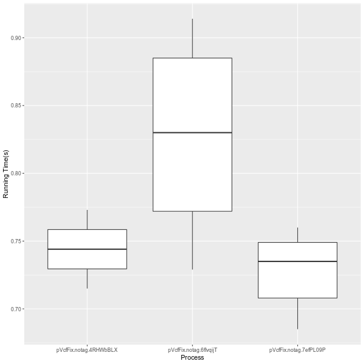
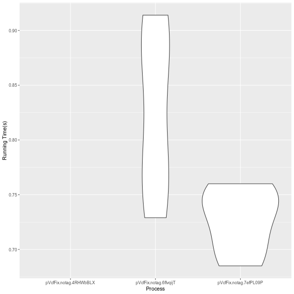
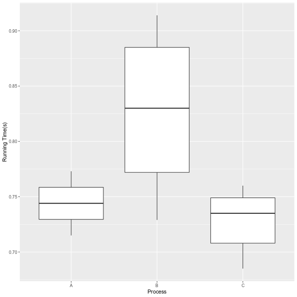

# pyppl_jobtime

Job running time statistics for [PyPPL](https://github.com/pwwang/PyPPL).

## Installation
Require `R` and `ggplot2`.
```shell
pip install pyppl_jobtime
```

After this plugin is installed, a file named `job.time` will be created in each job directory with running time in seconds saved in it.

## Plotting the running time profile
```shell
pyppl jobtime --proc pVcfFix --outfile profile.png
```



- Using violin plot:
    ```shell
    pyppl jobtime --proc pVcfFix --outfile violin.png --plottype violin
    ```
    

- Changing process names:
    ```shell
    pyppl jobtime --outfile procnames.png \
        --proc pVcfFix --ggs.scale_x_discrete:dict \
        --ggs.scale_x_discrete.labels:list A B C
    ```

    
